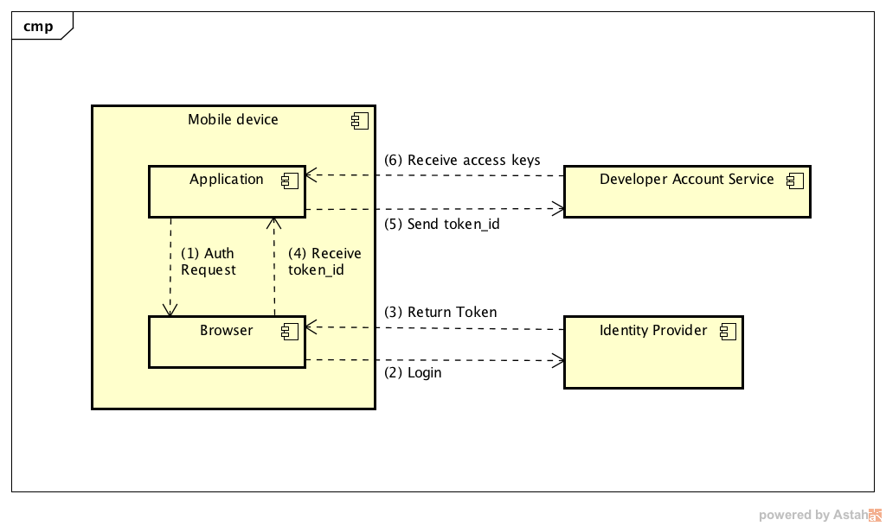
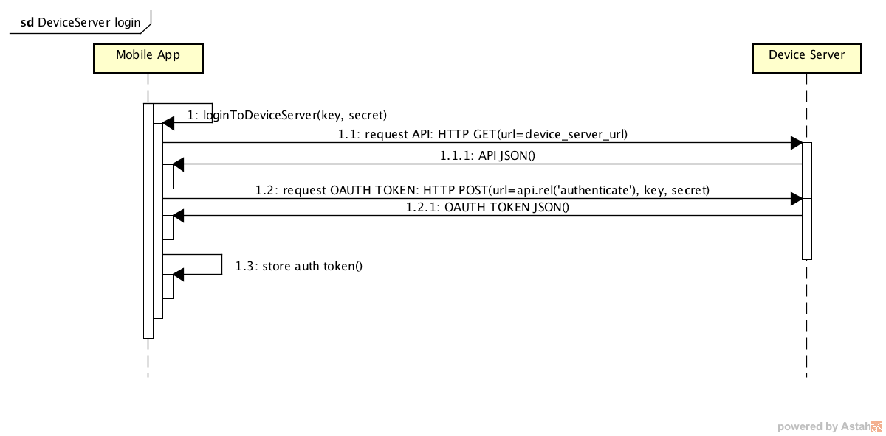
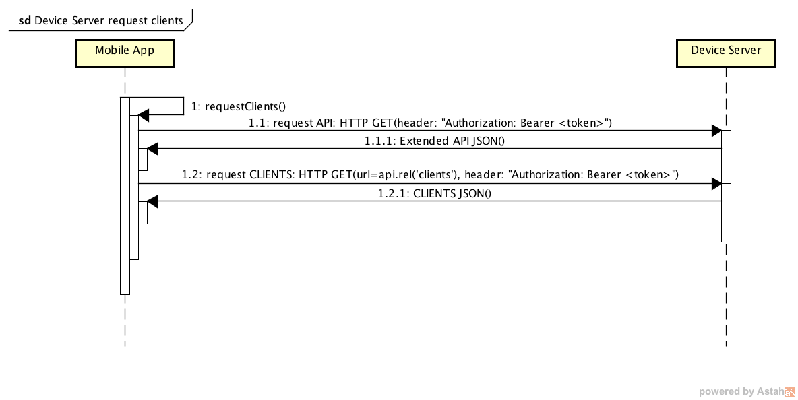
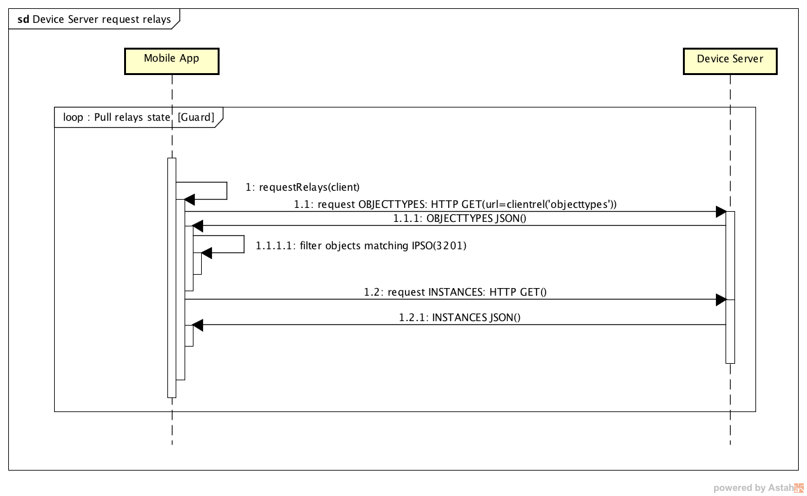
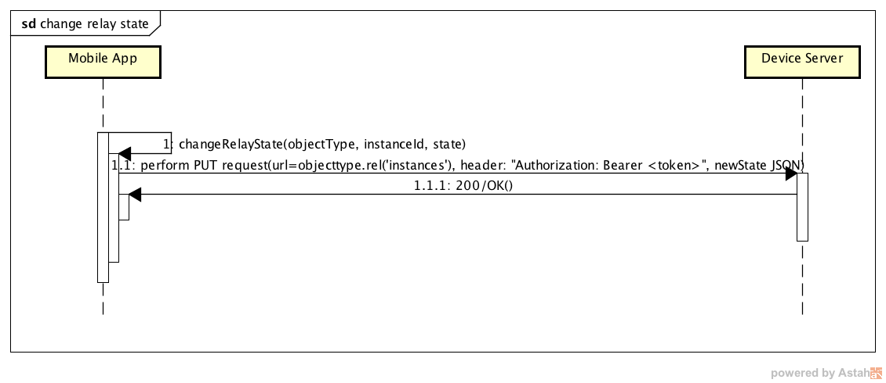

# Power switch

---
This project is a simple iOS application for controlling relay
through LWM2M protocol.
It is a complementary application to a 'relay-gateway' project
and it can be treated as a reference application for further development.

Similarly like in 'relay-gateway' project our target is 'relay device ' IPSO definition:

| Object Name       | Object ID      | Resource Name       | Resource ID |
| :----             | :--------------| :-------------------| :-----------|
| RelayDevice       | 3201           | DigitalOutputState  | 5550        |

## Prerequisites

Xcode 7.3.1

## About Application

As a reference application Power Switch covers 2 main use-cases:

* login to Developer Account Service (AS)
* communication with Device Server (DS):
    + login
    + request clients
    + request relay device implementing simple polling policy
    + changing relay device state

all in terms of the RESTful architecture with HATEOAS constraints.

### Authentication

Communication with Device server requires user to be authenticated.
To acquire key and secret, that will be used to obtain DS access token, the user has to login first with their CreatorID (points (1)-(4) on the following diagram):

(1) Open Safari View Controller for signing into identity provider with proper authorization request. Be sure to register your own client ID and redirectUri when developing your own apps (and the custom URL Type in the Xcode project).

(2) login/sign-up using Safari View Controller

(3) Identity Provider (IDP) issues an authorization code to the redirect URI

(4) openUrl: method is called in AppDelegate with registered URL Type containing token_id.

### Requesting access key

Leaving authorization behind we can now perform a request that gives us access key necessary to interact with device server.

To do that we have to perform POST request with token_id. Check previous diagram (points (5) and (6)).

### Communication with Device Server

Having key and secret user can login to device server. Diagram below shows this procedure.

Next step is to request for clients matching application criteria (client name 'RelayDevice').

With 'Client' instance we can easily request for 'object types' matching IPSO id=3201 and
its resources.

Last thing is an interaction with specific device. To change 'relay' state user must perform PUT request
with a new state of a device.

